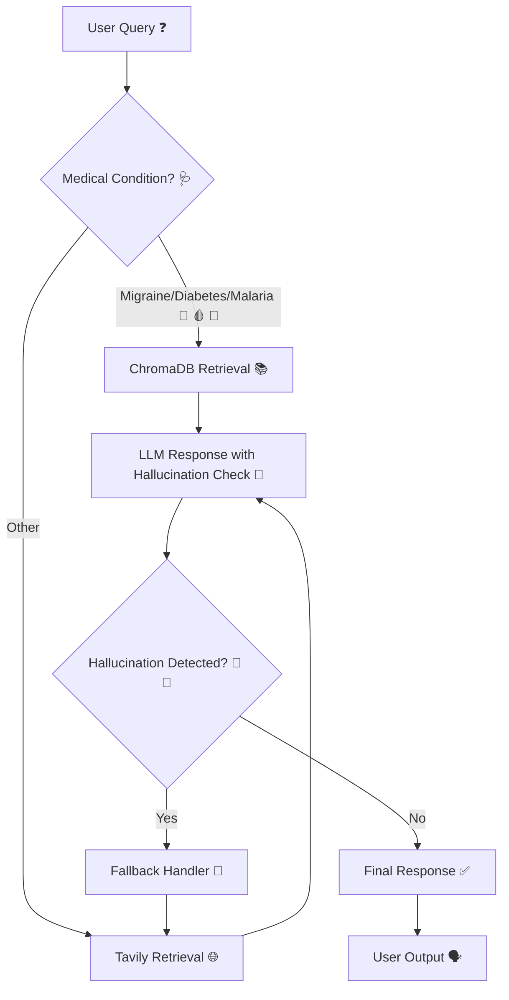

# Satya AI Powered Medial Assistant 

Satya is a RAG-based medical assistant designed to provide information about common medical conditions like migraines 🤕, diabetes 🩸, and malaria 🦟. It leverages LangChain 🔗 and LangGraph 🕸️ for a multi-agent system, ChromaDB 📚 for efficient vector storage, and incorporates hallucination grading 🧐 and fallback mechanisms 🔄 for robustness.

## Features ✨

* **Retrieval Augmented Generation (RAG):** 🔍
    * Provides accurate information about migraines 🤕, diabetes 🩸, and malaria 🦟 by retrieving relevant data from a ChromaDB 📚 vector database.
* **Multi-Agent System (LangGraph):** 🤖 🕸️
    * Utilizes LangGraph to orchestrate multiple agents, enabling complex interactions and information retrieval.
* **ChromaDB Vector Database:** 📚 ➡️ 🔢
    * Stores medical knowledge as vector embeddings for efficient similarity search and information retrieval.
* **Hallucination Grader:** 🧐 🚫 💭
    * Implements a hallucination grader to assess and mitigate potential inaccuracies in the LLM's responses.
* **Fallback Handler:** 🔄 🌐
    * If the RAG system cannot provide a satisfactory answer, Satya uses Tavily 🌐 to fetch relevant information from the web.
* **LLama Model:** 🦙 💬
    * Built on the LLama model for robust language generation.
* **LangGraph Studio Deployment:** 🚀 🐳
    * Deployed in LangGraph Studio using Docker for easy setup and accessibility.

## Architecture 🏗️

### Technologies Used 🛠️
LangChain: https://python.langchain.com/ 🔗

LangGraph: https://github.com/langchain-ai/langgraph 🕸️

ChromaDB: https://www.trychroma.com/ 📚

LLama: LLama 3 - 70B  🦙

Tavily: https://tavily.com/ 🌐

Docker: https://www.docker.com/ 🐳 

### Setup and Deployment 🚀
Clone the Repository:

Bash

git clone https://github.com/Shreyankthehacker/Satya-Medical-RAG-Assistant
cd Studio
Docker Installation: 🐳

Ensure Docker is installed on your system. Follow the official Docker installation guide for your operating system.
LangGraph Studio Setup: 💻 🚀

Follow the LangGraph Studio documentation for setup and deployment using Docker. This will likely involve using a docker-compose.yml file.
ChromaDB Configuration: 📚 ➡️ 🔢

Populate ChromaDB with medical information related to migraines 🤕, diabetes 🩸, and malaria 🦟. This may involve running Python scripts to ingest and embed data.
Ensure the chroma db is running inside the docker compose, or is configured to be accessed by the application.
Environment Variables: 🔑 ⚙️

Create a .env file in the root directory of your project.
Add necessary environment variables, including Tavily API keys, ChromaDB connection details, and any other required configurations. Example:
TAVILY_API_KEY=your_tavily_api_key
CHROMA_DB_PATH=/path/to/chroma/db
Ensure your Docker Compose file is configured to read the .env file.
Running Satya: 🏃 🐳

Use the docker-compose.yml file provided by LangGraph Studio to run the application.
Bash

docker-compose up --build
Usage 🗣️
Access Satya: 🌐 💻

Access the deployed Satya application through LangGraph Studio, typically via a web interface.
Ask Questions: ❓

Ask questions related to migraines 🤕, diabetes 🩸, or malaria 🦟.
If the question is outside of the provided medical condition, the application will use Tavily 🌐 to get the information.
Example Queries 📝
"What are the symptoms of migraine?" 🤕
"What are the different types of diabetes?" 🩸
"How is malaria transmitted?" 🦟
"What are the best treatments for a common cold?" (This query will use Tavily 🌐).

### Future Improvements 🚀 📈
Expand the medical knowledge base in ChromaDB. 📚 ➡️ ➕
Improve the hallucination detection and mitigation mechanisms. 🧐 ➡️ ✅
Enhance the user interface for better interaction. 🎨 🤝
Add more medical conditions to the RAG database. ➕ 🩺
Implement a more robust error handling. 🛠️ 🛡️
Add user authentication. 🔐 👤
Add a better way to store and manage the vector database. 📦 ➡️ 🛠️
Add tests. 🧪 ✅